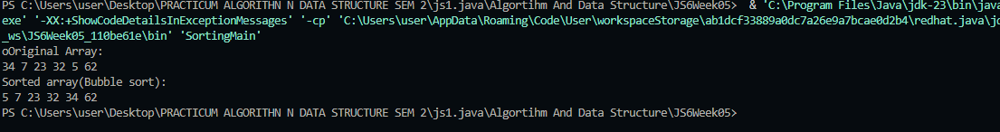
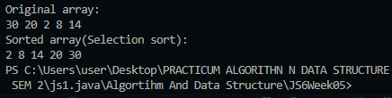
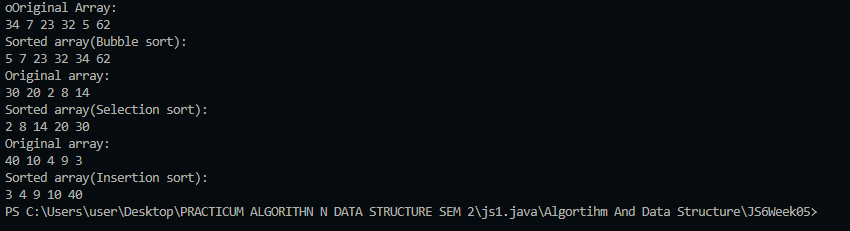
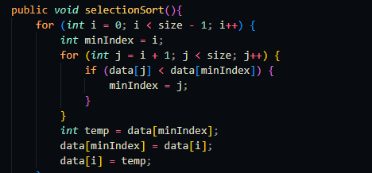

👋 Hi, I'm Wahyu!

📌 Personal Info

NIM: 244107020225

Class: TI-1i

Absent Number: 26

Labs #6 SORTING (BUBBLE, SELECTION, DAN INSERTION SORT)
6.2 Experiment 1 - Implementing Sorting Using Objects 

6.2.1 Experiment Steps 
show result

6.2.3 Verification of Experiment Results

6.2.4 Verification of Experiment Results

6.2.5 Questions!
1. For swap operation that used in algorithm sort
  if data[j] bigger than the next data[j+1 so it will be changed]
2.
3.data[j] is greater than key, so elements greater than key are shifted to the right to make room for correct insertion.
4.This command is used in insertion sort to shift larger elements to the right to make room to insert the element being processed (key).

6.3 Experiment 2- Sorting Using an Array of Objects 
  

