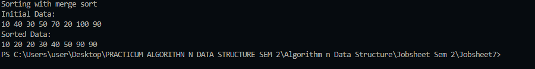

👋 Hi, I'm Wahyu!

📌 Personal Info

NIM: 244107020225

Class: TI-1i

Absent Number: 26
      JOBSHEET VII  SEARCHING 

  7.2 Sequential Search Method  
  Brief explanaton: There are 3 main component:

Students7.java:

Defines student attributes (NIM, age, name, GPA).
Provides a constructor to initialize student data.
Includes a display method to print student details.
SearchStudent7.java:

Manages an array of Students7 objects with a maximum capacity of 5.
Provides methods to: Add new students (checks if array is full) Display all student data Perform Sequential Search (linear search through array) Display search results (position and data)
MainStudent7.java:

Initializes two Scanner objects for user input.
Creates a SearchStudent7 object to manage student data.
Prompts user to input number of students and their details (NIM, name, age, GPA).
Displays all student data.
Searches for a student by NIM using both Sequential Search and Binary Search algorithms.
Displays search results including position and student details.
Questions:

showPosition shows only the NIM and its index while showData shows all students details other than NIM if found.
There a break statement there to exit the loop immediately when the NIM is found.
No errors will occur and still works on any order but its make its potentionally run slower.
-1 is being used here as a 'not found' indicator because it's an invalid array index but no with 0 which is a valid array index. If the search fails, the method returns -1, determining that the student wasn't found.   

7.3 Binary Search Method
Questions:
1.Divide process terjadi ketika data dipecah menjadi dua bagian. Dalam konteks Binary Search, ini terjadi saat kita menghitung nilai tengah (mid).
 Contoh kode:
int mid = (left + right) / 2; (this code is divide process )

2.if (listStd[mid].nim == cari) {
    posisi = mid;
    break;
} else if (listStd[mid].nim < cari) {
    left = mid + 1;
} else {
    right = mid - 1;
}
this code in conquer process when we compare with data that we search so we continou with searching one of array

3.If the data isn't unsorted, it will give incorrect result. If the data is sorted with descending order, it will fail to find the wanted data (20210), hence, modification needed:
public int FindBinarySearch(int cari, int left, int right) {
int mid; 
if (right >= left) { 
mid (left + right) / 2; 
if (cari == liststd[mid].nim) { 
return mid; 
} else if (listStd[mid].nim < cari) { 
return FindBinarySearch(cari, left, mid 1); 
} else { 
return FindBinarySearch(cari, mid + 1, right); 
} 
} 
return -1; 
}
4.Modify the program to make students amount inserted is matched with user input

SearchStudent7 data = new SearchStudent7(); 
System.out.print(s: "enter number of student: "); 
int amountstd = s.nextInt();

7.4 Review Divide and Conquer

The solution is implemented in MergeSort7.java & SortMain7.java, and below is the screenshot of the result.

MergeSort7.java:

1.Create method to call sort() method.
2.Initializes and run run sort() to recursively splits the arrays into halves until single elements remain. Then call merge() method to merges the halves back in order.
3.Initializes and run merge() method to compare and merge two sorted halves. Then, place smaller numbers first before copies any remaining element.
4.Create printArray() method to print the 

array elements.
SortMain7.java:

Creates an unsorted array.
1.Initializes the MergeSort7 sorter.
2.Print the original array. Proceed to call mergeSort() 3.to sort the array.
4.Prints the final sorted array.