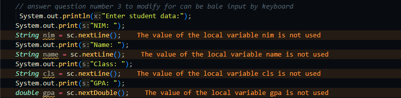
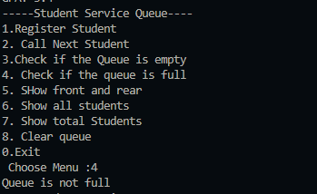
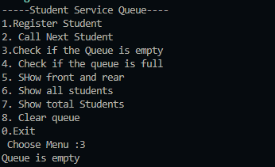

👋 Hi, I'm Wahyu!

📌 Personal Info

NIM: 244107020225

Class: TI-1i

2.1.2 Questions!
1.Why does the program show "LinkedList is empty!!" at the beginning?
Because the linked list has no data initially; head is null, so the print() method displays that message.

2.What is the general purpose of the temp variable?
It acts as a pointer to traverse the list without modifying the head. It helps with search, insertion, and deletion.

3.How to modify the code to add data from keyboard input?
Use a Scanner to input student data (NIM, name, class, GPA), create a Student object, then insert it into the list:

What if we don’t use the tail attribute?
4.Adding a node at the end becomes inefficient (O(n)), because we must traverse the list from head to the last node. With tail, we can add in O(1) time.

    EXPERIMENT 2 -  Section 2.2.3 Questions
1.Why is break used in the remove() method?
To stop the loop immediately after finding and removing the target node. This prevents unnecessary traversal or multiple deletions.
2.
-The first line skips over (removes) the node by linking to the one after it.
-The if checks if the removed node was the last; if so, it updates tail to point to the new last node.

Asssignment:

this for the  isfull case

this for the isEmpty case

