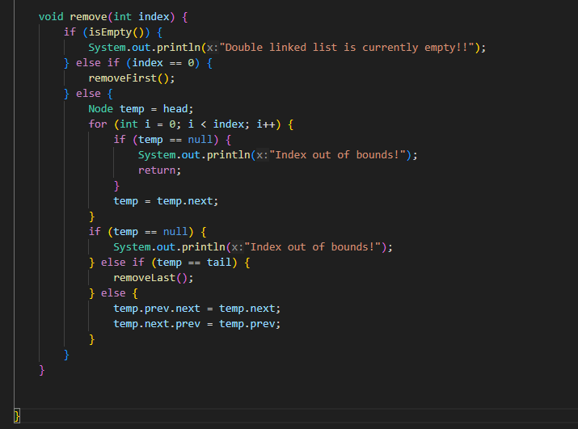

👋 Hi, I'm Wahyu!

📌 Personal Info

NIM: 244107020225

Class: TI-1i

Double Linked List - Questions and Answers
12.2.3 Questions (Experiment 1)
1. Explain the difference between a singly linked list and a doubly linked list

Singly Linked List:

1.Each node has only one pointer/reference (next) that points 2.to the next node
3.Traversal is only possible in one direction (forward)
4.Cannot directly access the previous node
5.Uses less memory per node (one pointer)
6.Simpler implementation

Doubly Linked List:

1.Each node has two pointers/references (next and prev)
2.next points to the next node, prev points to the previous node
3.Traversal is possible in both directions (forward and backward)
4.Can directly access both next and previous nodes
5.Uses more memory per node (two pointers)
6.More complex implementation but more flexible
2. Observe the Node class, which contains the attributes next and prev. What are the
purposes of these attributes?
next attribute: Points to the next node in the sequence. It allows traversal from the current node to the subsequent node in the forward direction.
prev attribute: Points to the previous node in the sequence. It allows traversal from the current node to the preceding node in the backward direction.
These two attributes together enable bidirectional traversal and make operations like insertion and deletion more efficient as we can access neighboring nodes directly.
3. Examine the constructor in the DoubleLinkedLists class. What is the purpose of this
constructor?
DoubleLinkedLists(){
    head = null;
    tail = null;
}
Purpose: This constructor initializes an empty doubly linked list by setting both head and tail pointers to null. This represents an empty list state where there are no nodes present.
4. In the addFirst() method, what is the meaning of the following code?
if(isEmpty()){
     head = tail = newNode;
}
Meaning: This code handles the case when the list is empty. When adding the first node to an empty list, that single node becomes both the head (first node) and tail (last node) of the list. Since there's only one node, head and tail point to the same node.
5. In the addFirst() method, what does the statement head.prev = newNode mean?
Meaning: This statement sets the previous pointer of the current head node to point to the newNode. Since newNode is being inserted at the beginning, it becomes the new head, and the old head's previous pointer should point back to this new head node.
6. In the insertAfter() method, what is the meaning of current.next.prev = newNode?
Meaning: This statement updates the previous pointer of the node that comes after the current node to point to the newNode. When inserting newNode between current and current.next, we need to update the backward link so that the node after current now points back to newNode instead of current.
7. In the experiment 1 code, in which method the traversal process implemented? What is
the meaning of temp = temp.next ?
Method: The traversal process is implemented in the print() method and insertAfter() method.
Meaning of temp = temp.next: This statement moves the temporary pointer to the next node in the sequence. It's the fundamental operation for traversing through the linked list from one node to the next.
8. In the insertAfter() method, what is the following code for?
if(temp == tail){
     addLast(data);
}
Purpose: This code handles the special case where we want to insert after the last node (tail). Instead of manually handling all the pointer manipulations, it delegates to the addLast() method which is specifically designed to handle tail insertion.
Do we have to implement it? Yes, it's recommended because it maintains code consistency and handles edge cases properly.
What if we remove it? Without this check, we would need to manually handle the tail pointer updates and null pointer situations, making the code more complex and error-prone.
Do we have to implement it? What if we remove it?
9. In the insertAfter() what is this statement if(temp.data.nim.equalsIgnoreCase(key)) for?
Purpose: This statement compares the NIM (student ID) of the current node with the provided key (ignoring case sensitivity). It's used to find the specific node after which we want to insert the new data. The method searches through the list until it finds a node whose NIM matches the given key.

12.3.3 Questions (Experiment 2)
1. What is the use of the following statement in the removeFirst() method?
head = head.next;
head.prev = null;
Purpose:

*head = head.next; moves the head pointer to the second node, effectively removing the first node from the list
*head.prev = null; sets the previous pointer of the new head to null since the head node should not have a previous node
2. Why is it important to include conditions and processes like the ones below in both
removeFirst() and removeLast() methods? Explain!
else if(head == tail){
head = tail = null;
}
Importance: This condition handles the case when there's only one node in the list (head and tail point to the same node). When removing this single node, both head and tail must be set to null to represent an empty list. Without this check, we might end up with dangling pointers or inconsistent list state.
3. In the removeLast() method, if there is no tail attribute inside DoubleLinkedLists
void removeLast()
class, what approach or changes need to be made to the code of the method?
if(isEmpty()){
        System.out.println("List is empty");
    } else if(head.next == null){ // only one node
        head = null;
    } else {
        Node temp = head;
        while(temp.next.next != null){ // find second-to-last node
            temp = temp.next;
        }
        temp.next = null; // remove last node
    }

4. What is the purpose of the initial if(isEmpty()) check in the remove(int index)
method?
Purpose: This check prevents attempting to remove elements from an empty list, which would cause errors or exceptions. It provides a clear error message to the user instead of crashing the program.
5. Explain how the method handles the removal of a node at the beginning (index == 0) and at the end (temp == tail) of the linked list.
At the beginning (index == 0): The method delegates to removeFirst() which handles updating the head pointer and setting the new head's prev to null.
At the end (temp == tail): The method delegates to removeLast() which handles updating the tail pointer and setting the new tail's next to null.
6. Describe how the method updates the links between nodes when removing a node
from the middle of the linked list.
temp.prev.next = temp.next;  
temp.next.prev = temp.prev;
 the node to be removed by connecting its neighboring nodes directly to each other, removing all references to the target node.
7. The remove(int index) method currently does not check for negative index or index
that exceed the size of the DoubleLinkedLists. Please add statements to handle these
cases.
